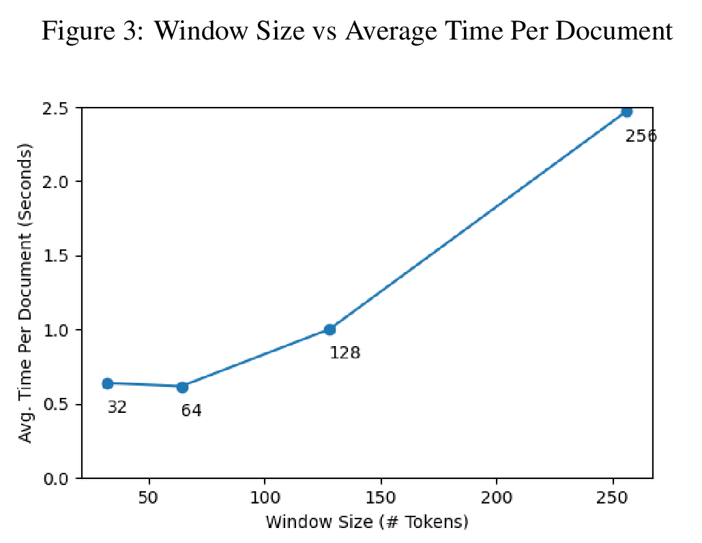
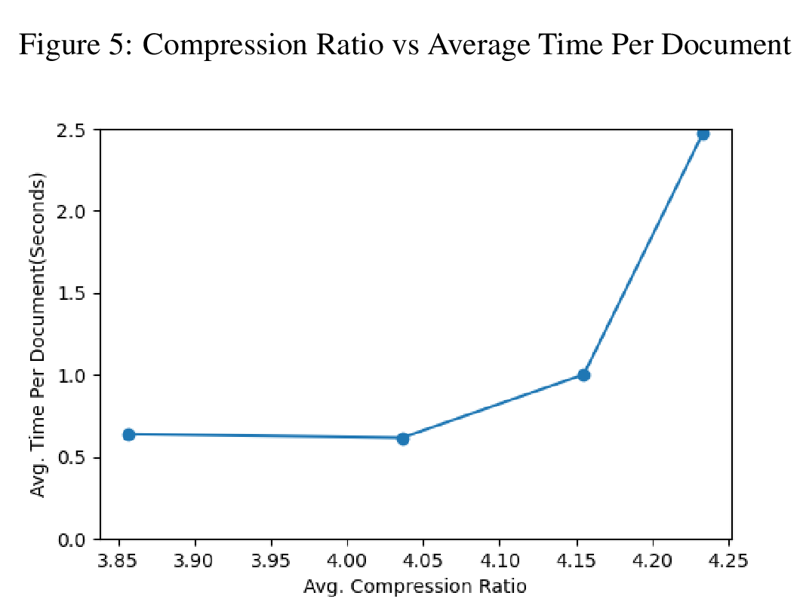

# Abstract

As the volume of text-based data continues to rapidly increase, the requirement for efficient compression methods is greater than ever before. The advancements in Natural Language Processing (NLP) provide a golden opportunity to employ semantically-driven methods for text compression. Our project aspires to extend the boundaries of text compression by integrating a transformer-based neural network with two distinct data compression techniques: variable-length integer encoding and arithmetic encoding. Preliminary results from our project indicate that our neural text compression strategy achieves a compression ratio twice that of the industry-standard Gzip. Despite the computational time for our neural-based compression being notably longer compared to other baselines, we've discovered that this can be minimized by implementing a windowing approach, thereby reducing the impact of high self-attention computations.

# Approach

Our method involves feeding our transformer-based model with a document, word-by-word, to compress. For instance, when processing word wi, the model is given the previous k′ words, w_i−k′, ..., w_i−2, w_i−1, words in a sequence and is tasked with generating a vocabulary distribution for the prediction of the next word, where k′ denotes the number of words preceding wi in the current window. This next-word distribution is organized from the highest probability to the lowest. We continuously iterate over these next-word options until we identify w_i. The position of this word in the sorted list is subsequently processed through either our variable-length integer encoding algorithm or our arithmetic encoding algorithm, and this encoded information forms a part of the compressed data. We chose the pretrained GPT2 model as our preferred transformer due to its highly effective "next-word" prediction capability that aligns seamlessly with our needs, and we further fine-tune it on the task of text generation using the wikitext2 dataset.

For the reconstruction phase, we merely reverse the encoding process: we feed the compressed data into the variable-length integer or arithmetic decoder to obtain the index associated with the model's sorted next-word prediction. Consequently, we can route each decoded word back through the model to retrieve each succeeding word.

# Results

As observed in Figure 2 and Table 1 regarding the compression ratio, our neural methodologies outperform our baseline strategies. Both the variable-length integer and arithmetic encoding neural techniques result in a compression of the input text by over 4 times, which is notably higher compared to the 2 times compression achieved by our Gzip and statistical encoding baselines.

The following diagrams further depict how the window size impacts the speed of neural compression. Utilizing smaller windows resulted in enhanced compression speeds, with a slight anomaly that the speed was marginally better for k = 64 in comparison to k = 32 (Fig 3). With a window size greater than 64 (k > 64), the compression speed seems to increase in a super-linear fashion. The average processing time per document for k = 128 is approximately 1.5 times slower than for k = 64, whereas for k = 256 it's approximately 2.5 times faster than k = 128.

Contrarily, changes in window sizes didn't show substantial effects on the compression ratio. Irrespective of the window size, the compression ratio hovered around 4x, with a slight enhancement from 3.86 to 4.23 between window sizes of k = 32 and k = 256 (Fig 4). Figure 5 illustrates the balancing act between compression ratio and processing time.

